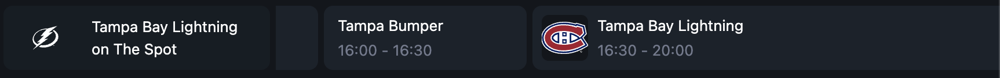
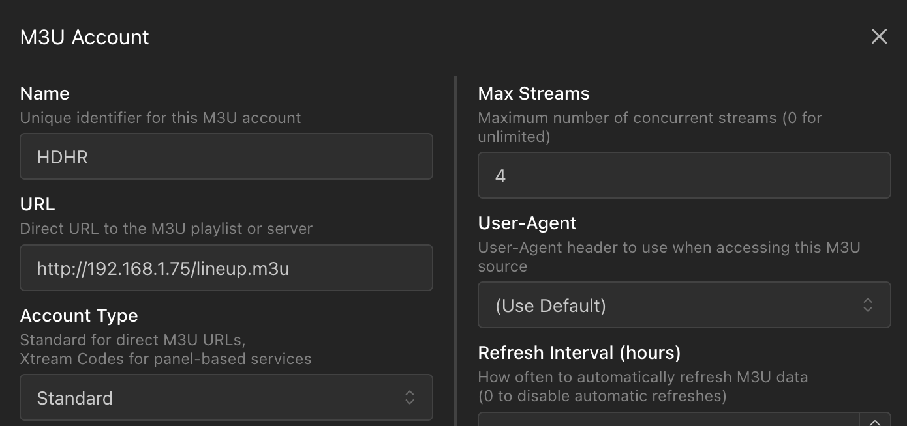
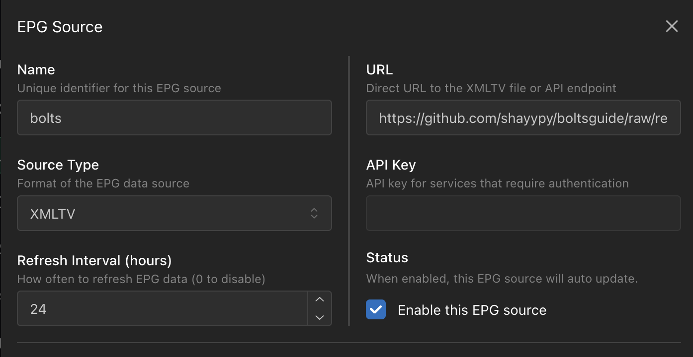
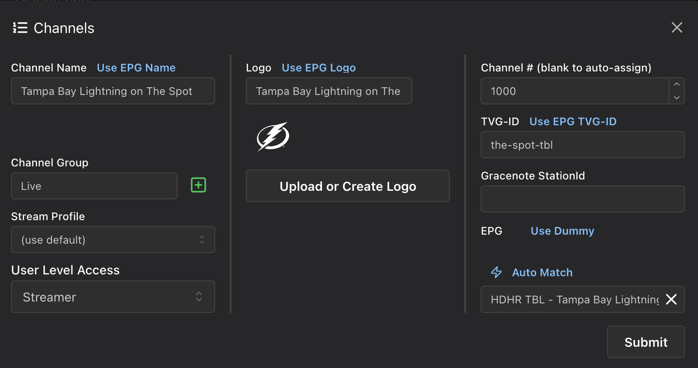

# boltsguide

## Problem

Some local channels which [rebroadcast Lightning games](https://www.nhl.com/lightning/multimedia/how-to-watch#channel) at times do not have their EPG timeslots properly dedicated to the game. This prevents DVRs from automatically scheduling recordings for games on that channel - and if you manually record what's on, it'll show up as mislabeled programming in your library.

## Solution

This script generates an alternative guide file (channel id `the-spot-tbl`) with timeslots for every Tampa game (home or away). It does not factor in whether a game will actually be on the local channels (most are) since I don't know of a reliable way to determine that.

## How it works

The script asks the NHL API for game dates for the next 2 weeks, filters out everything that isn't a Tampa game, and assigns them all to the guide. It then generates bumpers (see [below](#timing)) between each game.

Each game is configured as an episode so that you can schedule recurring recordings of the 'show' called "Tampa Bay Lightning". They are subtitled either "vs" or "at" the opponent du jour - this should show up as the episode name.

The guide file is regenerated every Sunday at 12:00 AM UTC. If you fork this repository, you can change the cron schedule in `.github/workflows/generate.yml`. Ensure actions have read & write access in your repository settings.

### Timing

Factors in a 30-minute pregame and includes 1-hour bumpers between each game. If a game is running long (over 3 hours), you can record the bumper right after the game for an extra hour, which will be listed in your library as "Tampa Bumper". I'm not sure how many DVRs make use of this, but the bumpers are listed as individual "parts" of the prior game using the xmltv_ns episode numbering system. For example, if the previous game is `2025.021234.`, its bumpers leading up to the next game are `2025.021234.0`, `2025.021234.1`, and so on. They duplicate the onscreen (S2025E021234) value.

## Usage

This assumes you are using a program such as Dispatcharr or xTeVe/Threadfin (ahead of Plex/Emby/Channels DVR to actually display and record streams). This project is not compatible with "plain" systems such as unassisted TVs or Plex without an XMLTV guide.

### Dispatcharr

1. Add your stream source if you haven't already
    - Go to M3U & EPG Manager
    - Add your HDHomeRun's (or similar device) M3U playlist URL. On HDHR devices, this is available at `lineup.m3u` under the device's IP.

2. Add the guide
    - Still in M3U & EPG Manager, click Add EPG -> Standard EPG Source
    - Add the direct link to the guide file and set the source type as XMLTV
        - https://github.com/shayypy/boltsguide/raw/refs/heads/main/guide.xml

3. Create a channel
    - Go to the Channels tab and locate "HDHR" (or whatever you named the M3U source) on the right panel
    - Click the plus button to add it as a new channel
    - Number assignment is up to your personal preference and how you have configured Dispatcharr. If you don't know, just choose "auto-assign next available"
    - Edit the channel and match it to the EPG that you added in the previous step. To do this, find the box at the bottom right, select the source ("bolts" in my example), then click on the only channel that shows up (`Tampa Bay Lightning on The Spot (the-spot-tbl)`). Use the TVG-ID from the EPG (right panel) and configure the name and logo however you want.

This setup allows me to keep the local channel's original guide as well as a duplicate channel entry just for the games, since I have my HDHR added as a separate device from Dispatcharr in Plex. If you are running your HDHR through Dispatcharr already and you wish to retain the original guide, you may have to duplicate your HDHR M3U listing so that you can create a separate Dispatcharr channel.

## Images

In order to avoid spoiling game scores with auto-generated thumbnails, I opted to try to include banners with each episode. These are provided by [thesportsdb.com](https://www.thesportsdb.com/season/4380-nhl/2025-2026&t=134836) via a per-season CSV file stored in the images directory. I found their API to be a bit unwarranted for my purposes - instead I devised the current solution, which requires zero automated requests (or one per game if you think the client loading an image counts as automated). The downside is that the CSV file must be replaced each season if there are any new matchups (e.g. a new team is introduced).
